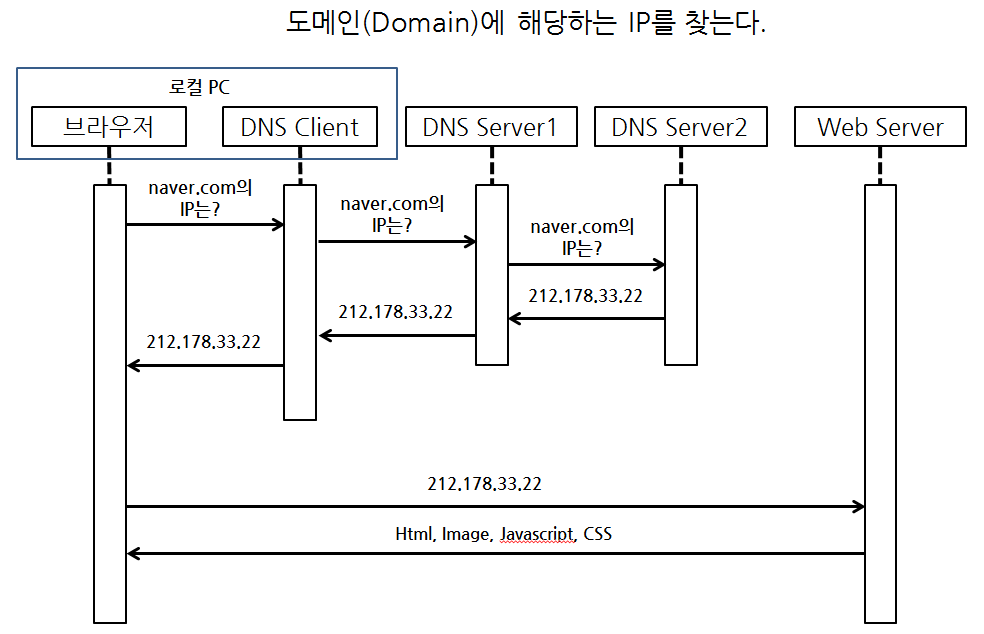

## step2 - DB 없이 기능 구현

서버에 요청할 때 아무것도 작성하지 않으면 get방식 -> url에 data노출

-> form 태그에 method = “post”라고 하면 post방식, controller에도 @PostMapping으로 변경 -> url에 data노출x

Controller의 setMethod 이름은 form tag에서의 name과 동일해야 그 기능을 할 수 있다

Controller를 타면 html은 templates 디렉토리에 있어야 한다

mustache, handlebar엔진 사용하려면 templates 디렉토리에 있어야 한다

예를 들어 Controller에서 어떤 메소드의 reuturn값이 “list”라면 list.html은 templates 디렉토리에 있어야한다

url에 직접 ~/list.html을 하고 싶다면 그 html은 static 디렉토리에 있어야 한다

return값이 “redirect:/list”라면 주소가 ~/list를 호출하고(마치 url에다가 ~/url)을 입력한것처럼 그 곳에서 필요한 html을 뿌려준다

html 에서 for문 돌 때

{{#users}} ~ {{/users}}

#### 웹 서버와 클라이언트의 이해

#### mustache 문법 참조

- <https://mustache.github.io/mustache.5.html>

#### status code 단위별 의미는?

- 2XX : 성공. 클라이언트가 요청한 동작을 수신하여 이해했고 승낙했으며 성공적으로 처리
- 3XX : 라다이렉션 완료. 클라이언트는 요청을 마치기 위해 추가 동작이 필요함.
- 4XX : 요청 오류. 클라이언트에 오류가 있음
- 5XX : 서버 오류. 서버가 유효한 요청을 명백하게 수행하지 못했음

#### GET, POST 사용하는 기준은?

get방식 :  data를 가져오거나 뿌릴 때

post방식 : data를 추가 및 수정할 때

- GET은 Select적인 성향을 가지고 있습니다. GET은 서버에서 어떤 데이터를 가져와서 보여준다거나 하는 용도이지 서버의 값이나 상태등을 바꾸지 않습니다. 게시판의 리스트라던지 글보기 기능 같은 것이 이에 해당하죠.

- POST는 서버의 값이나 상태를 바꾸기 위해서 사용합니다. 글쓰기를 하면 글의 내용이 디비에 저장이 되고 수정을 하면 디비값이 수정이 되죠. 이럴 경우에 POST를 사용합니다.

  

#### URL(Uniform Resource Locator)

- URI(Uniform Resource Identifier)라고도 함.
- URI가 URL보다 더 상위 개념이지만 현재 혼용해서 사용하고 있음. 같은 것으로 이해해도 무방함

------

- URL은 <http://slipp.net/questions/539> 와 같은 구조로 구성되어 있다.
- URL은 스킴(scheme), 호스트명, 경로명으로 구성된다. 위 예에서 스킴은 http, 호스트명은 slipp.net, 경로명은 questions/539가 된다.

#### 웹 브라우저에서 POST 요청을 처리하는 경우

- [POST-redirect-GET](https://en.wikipedia.org/wiki/Post/Redirect/Get) Pattern
- 중복 submit을 방지하기 위한 패턴. 이 패턴을 사용한다고 해서 모든 중복 submit을 막을 수 있는 것은 아니다.
- HTTP 1.1 spec으로 보면 303 status code를 사용하는 것이 맞으나 아직까지 대부분은 302를 사용함.